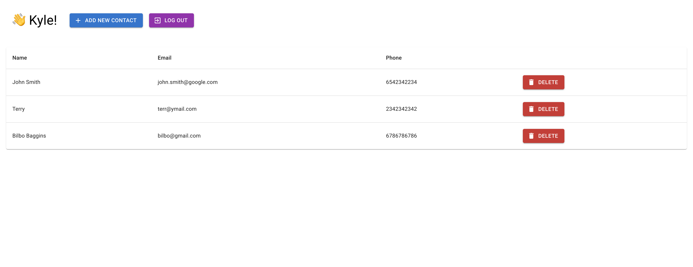

# Leverage

- [Product Challenge](./docs/product-challenge.pdf)
- [Work items](https://trello.com/b/eaOgeT4J/leverage)

## Local Environment Setup

- See [docs/yarn.md](./docs/yarn.md) for Yarn global installation instructions.
- Install dependencies from root: `yarn`
- `.env` files are checked in for convenience
- Run all: `yarn start`
  - React client runs on port 3000
  - NestJS server runs on port 2363
  - YMMV with local DB setup
- Test all: `yarn test`
  - executes E2E Cypress tests

## Preview

